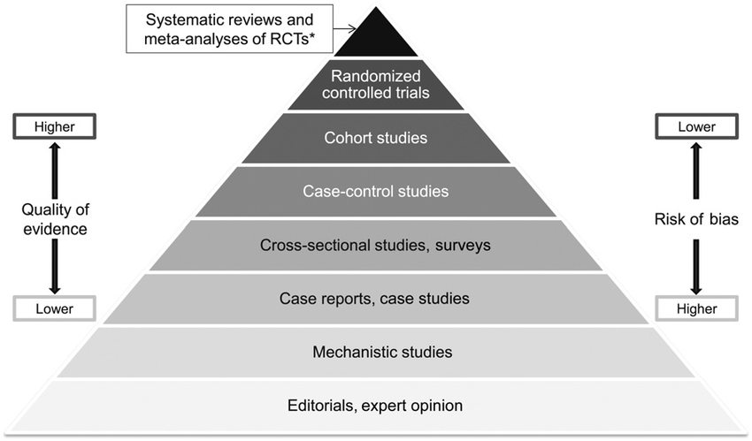
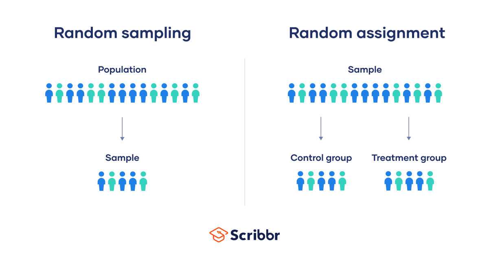

# Introduction to Probability and Data with R

## Designing Studies

**Describe when a study’s results can be generalised to the population at large and when causation can be inferred.**

Generalisatability is known as external validity. Sample bias is the principle reason a study's results cannot be generalised to the population at large. Causation can be inferred when we have randomised control trials, i.e. the treatment is exogenous to the units' choices, we control for confounders and latent variables. This is not possible in observational studies.

**Explain why random sampling allows for generalizability of results.**

Random sampling allows for generalizability of results because it helps to ensure that the sample is representative of the population from which it is drawn. This means that the results of the study can be generalised to the population at large.
**Explain why random assignment allows for making causal conclusions.**

Randomised controlled trials sit atop the  "hierarchy of evidences pyramid" 

This is because the treatment is exogenous to the units in the test. It removes the worry of latent variables or endogeneity.

**Describe a situation where cluster sampling is more efficient than simple random or stratified sampling.**

> In a cluster sample, we break up the population into many groups, called clusters. Then we sample a fixed number of clusters and include all observations from each of those clusters in the sample.

Cluster sampling is more efficient than simple or statifed sampling. The clusters need to be interally heterogeneous (unlike stratified sampling where the strata are homogenous selected based on commonality) and each cluster is similar to another.

> One might divide a city into geographic regions that are on average similar to each other, and then sample randomly a few of these regions, go to these randomly picked regions, and then, sample a few people from within these regions. This avoids the need to travel to all of the regions in the city.

**Explain how blinding can help eliminate the placebo effect and other biases.**

A double-blind is when neither the participants nor the researchers know who is receiving the treatment and who is receiving the placebo. This prevents the researcher inadverently baising the results by subconsciously treating the participants differently.

## Working with Data

What type of data are you working with? 
- Categorical - binary, ordinal, nominal, etc.
- Quantitative - continuous, discrete

Relationships between variables. 
- When two variables show some connection with one another, they are called associated or dependent variables.
- The association can be further described as positive or negative, and for these variables the association appears to be positive. 
- If two variables are not associated they are said to be independent.

## Sampling bias

> Think about something you're cooking. We taste, in other words, we examine a small part of what we're cooking, to get an idea about the dish as a whole. We would never eat a whole pot of soup just to check it's taste after all. When you taste a spoonful of soup and decide that spoonful you're tasted isn't salty enough, what you're doing is simply exploratory analysis for the sample at hand. If you then generalize and conclude that your entire needs salt, that's making an inference. For your inference to be valid, the spoonful you tasted, your sample, needs to be representative of your entire pot, your population. If your spoonful comes only from the surface, and the salt is collected at the bottom of the pot, what you tasted is probably not going to be representative of the whole pot. On the other hand, if you first stir the soup thoroughly before you taste, your spoonful will be more likely to be representative of the whole pot.

An obvious form of sampling bias is those who are easier to contact (for whatever confounding variable) are more likely to show up in your test. Known as convenience sampling.

Non-response bias is another form of sampling bias. This is when some **non-random** subset of the population are more likely to respond to the survey than others.

Voluntary response bias is when the sample is self-selected. This means that the sample is not random (unlike non-response bias). For example, if you are asking people if they would like to participate in your study, and you only get responses from people who are willing to respond.

Another consideration is that populations are non-stationary. This means that the population can change over time. Tastes, preferences, behaviours, environmental factors. These can all be latent variables.

## Experimental design

The four principles of experimental design are control, randomize, replicate, and block.

- Explanatory variables also sometimes called factors, are conditions we can impose on our experimental units. Blocking variables, on the other hand, are characteristics that the experimental units come with, that we would like to control for. 
- Blocking is basically like stratifying, expect used in experimental settings when randomly assigning as opposed to when sampling.
- Stratified sampling allows for controlling for possible confounders in the sampling stage, while blocking allows for controlling for such variables during random assignment.

### random sampling versus random assignment

> Random sampling occurs when subjects are being selected for a study. If subjects are selected randomly from the population, then each subject in the population is equally likely to be selected, and the resulting sample is likely representative of the population.

> Random assignment occurs only in experimental settings, where subjects are being assigned to various treatments. Taking a close look at our sample, we usually see that the subjects exhibit slightly different characteristics from one another. Through a random assignment, we ensure that these different characteristics are represented equally in the treatment and control groups. This allows us to attribute any observed difference between the treatment and control groups, to the treatment being observed on the subjects, since otherwise these groups are essentially the same. In other words, random assignment allows us to make causal conclusions based on the study.

This should be taken with a pinch of salt:

